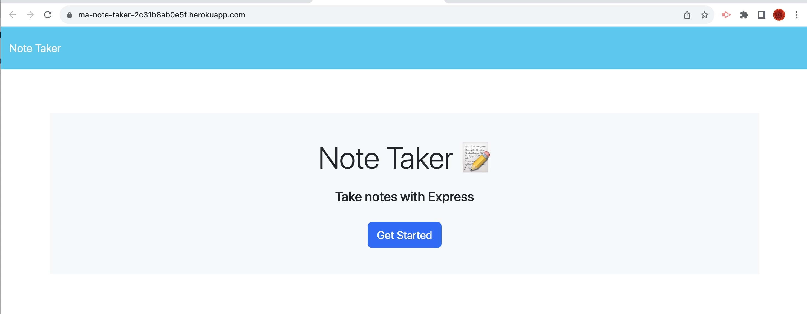
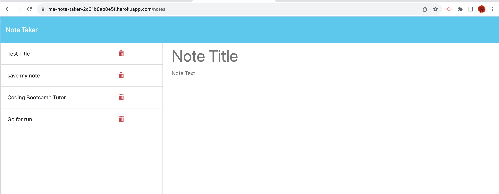

## MA-Note-Taker

# User Story
As a busy professional, 
I WANT to access a note taking application to write and save notes
SO THAT I can organize my thoughts and keep track of tasks.

# Code Description
This repository contains HTML, CSS, and Javascript to run the front-end of the application. The back-end utilizes javascript, express, uuid, and is deployed on heroku. 

# References
1. Tutor session with Michael Calimbas to fix code issues in my server.js file. Learnt correct declarations for note deletion, correcting file paths for app.use to access front end urls, and deployment to heroku.
2. Ask BCS team when encountering error to deploying application to heroku. Learnt providing heroku access to dynamic port.

# MA-Note-Taker Application Screenshots

# Github Repository URL
https://github.com/afzama/MA-Note-Taker 

# Published application on heroku
https://ma-note-taker-2c31b8ab0e5f.herokuapp.com/notes

